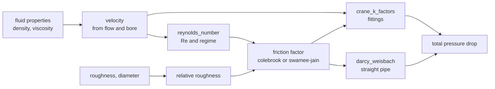

# azoth

Open, validated, citable chemical engineering calculations.

Every calculation in this book ships with its equation, where the equation came
from, the range in which it is validated, its assumptions, a worked example, and
the tests that exercise it. Nothing here is prose written alongside code: the
pages under [Hydraulics](./hydraulics/index.md) are **generated from the same
specification files the code is generated from**, so they cannot drift from it.
CI regenerates them and fails on any difference.

## The two ideas this library is built around

**Warnings are not errors.** A value outside the range in which a correlation was
validated is still a value. Refusing to return it would be less useful than
returning it with a warning. What the library must never do is return it
*silently*.

**A check that could not run is not a check that passed.** When an optional input
is missing, the range check that depends on it reports `RANGE_CHECK_SKIPPED`
rather than quietly succeeding. "Checked and fine" and "never checked" are
different states, and the API keeps them different.

Both are visible in every result: each carries its warnings, and each can be
asked whether it is clean.

## Reading a calculation page

Each page has the same shape, and the order is deliberate:

| Section | Why it is there |
|---|---|
| Equation | In LaTeX for a reader, and in the form the library evaluates, so you can check one against the other |
| Source | Where the equation came from. Marked `TODO: source needed` when it is not confirmed |
| Verification | Whether a person has checked the citation. **Read this before trusting a number** |
| Inputs and outputs | Names, units, and what they mean |
| Valid range | The bounds, what happens when one is violated, and why each exists |
| Assumptions | What is **not** checked at runtime, and is therefore your responsibility |
| Worked example | A fully specified case you can reproduce by hand |
| Tests | What is actually exercised, including what is deliberately skipped and why |

## What is implemented

Three namespaces. The first is the hydraulics kernel through Darcy-Weisbach
pressure drop. The second exists to demonstrate that nothing in the pipeline is
shaped around it. The third is where the model stops being a correlation over a
geometry: an equation of state is implicit, mixture-valued, and written in reduced
variables rather than in quantities with units.

**Hydraulics** - [`hydraulics/index.md`](./hydraulics/index.md):

- [`hydraulics.reynolds_number`](./hydraulics/reynolds_number.md)
- [`hydraulics.friction_factor_colebrook`](./hydraulics/friction_factor_colebrook.md)
- [`hydraulics.friction_factor_swamee_jain`](./hydraulics/friction_factor_swamee_jain.md)
- [`hydraulics.friction_factor_haaland`](./hydraulics/friction_factor_haaland.md)
- [`hydraulics.crane_k_factors`](./hydraulics/crane_k_factors.md)
- [`hydraulics.darcy_weisbach`](./hydraulics/darcy_weisbach.md)
- [`hydraulics.pump_power`](./hydraulics/pump_power.md)
- [`hydraulics.orifice_flow`](./hydraulics/orifice_flow.md)
- [`hydraulics.control_valve_cv`](./hydraulics/control_valve_cv.md)
- [`hydraulics.choked_flow_area`](./hydraulics/choked_flow_area.md)

**Heat transfer** - [`thermal/index.md`](./thermal/index.md):

- [`thermal.conduction_plane_wall`](./thermal/conduction_plane_wall.md)

**Equations of state** - [`eos/index.md`](./eos/index.md):

- [`eos.pr_kappa`](./eos/pr_kappa.md)
- [`eos.pr_alpha_ab`](./eos/pr_alpha_ab.md)
- [`eos.pr_z_factor`](./eos/pr_z_factor.md)
- [`eos.pr_departure`](./eos/pr_departure.md)
- [`eos.prsv_kappa`](./eos/prsv_kappa.md)
- [`eos.vdw1f_mix_binary`](./eos/vdw1f_mix_binary.md)
- [`eos.rachford_rice_binary`](./eos/rachford_rice_binary.md)
- [`eos.pr_molar_volume`](./eos/pr_molar_volume.md)
- [`eos.pr_mass_density`](./eos/pr_mass_density.md)
- [`eos.ideal_gas_cp`](./eos/ideal_gas_cp.md)

*Models* - whose specs fix a procedure rather than an equation:

- [`eos.pure_saturation`](./eos/pure_saturation.md)
- [`eos.pt_flash`](./eos/pt_flash.md)
- [`eos.bubble_pressure`](./eos/bubble_pressure.md)
- [`eos.dew_pressure`](./eos/dew_pressure.md)
- [`eos.molar_enthalpy_entropy`](./eos/molar_enthalpy_entropy.md) — a *direct* model, which composes vectors with no iteration

Relief valve *sizing* to a standard is not implemented; `hydraulics.choked_flow_area`
is the isentropic basis, with the standard's de-rating coefficients left to the caller.

## How the pieces fit together

Each calculation is independent, and the composition is done by the caller. The
`azoth pipe` command performs the one shown here, and reports the two pressure
drop contributions separately rather than only their sum - they come from
different methods, and seeing which one dominates is part of judging the answer.

Note the two arrows leaving the friction factor. The straight-pipe loss uses
`f * L/D`, and the fitting loss uses each fitting's equivalent length ratio
scaled by the *same* `f`. Feeding the fitting calculation with anything other
than the friction factor actually used for the pipe would make the two
contributions inconsistent with each other.

## Not for design work yet

The fitting coefficients in `data/fittings/crane_k_factors.csv` are **estimated
dummy values** - plausible magnitudes chosen so the software has something to run
against. They are not from Crane TP-410 or any other standard, and a pressure
drop computed from them can be wrong by a factor of two while looking entirely
reasonable. Every affected result carries an `ESTIMATED_DATA` warning, and the
[`crane_k_factors`](./hydraulics/crane_k_factors.md) page says so at the top.

Water and air properties are a different case: real published values, marked
`unverified` because they have not been checked against a primary formulation.

## How a calculation is added

1. Write a spec under `specs/calcs/<namespace>/<name>.yaml`.
2. Write one function in Python and one in Rust.
3. Declare the tests in the spec.

The documentation, the range checks both implementations enforce, and the test
cases both implementations run are all generated from that one file. If you can
write the spec, you have written the calc, the tests and the docs.

A few things are deliberately **not** generated, and a test is what makes
omitting one fail the build rather than fail at call time: the result dataclasses
on both sides, which are the cross-language shape contract; the batch wrapper;
and the two hand-maintained lists of what is implemented.

## The batch API

[`azoth.batch`](./batch.md) evaluates any of these calculations over arrays, with
one call crossing into the Rust core instead of N. It is a loop over the same
scalar kernels, not a second implementation, so the cross-language claim is
unchanged - and it deliberately gives up one thing the scalar API provides, which
is unit checking. See the [batch page](./batch.md) before using it.

## Licence

The code is **AGPL-3.0-or-later**. The documentation and the reference data are
**CC-BY-4.0** - attribution only, no copyleft. See `LICENSE` and
`LICENSE-CC-BY-4.0` in the repository root.

The split is deliberate. A validated calculation library is only worth what its
validation is worth, and validation that cannot be read cannot be checked, so the
code carries the copyleft. The equations and coefficients are the part most
people want to reuse or cite, and those should not require adopting a copyleft
obligation to do it.

