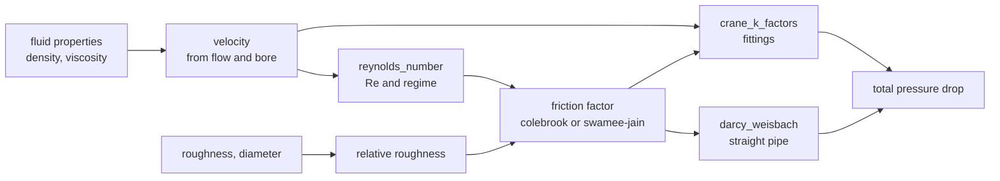

# azoth

This book is the **human entry point** for azoth: how to install it, pick a calculation,
read its page, and call it. The **agentic entry point** is
[the agentic section](./agentic/index.md) and, at the repository root, `CLAUDE.md` and
`AGENTS.md`.

Start here: `pip install azoth`, pick a calculation from
[What is implemented](#what-is-implemented), read its page for the equation, range and
worked example, then call it as the page shows or over arrays with
[the batch API](#the-batch-api).

Every calculation in this book ships with its equation, where the equation came
from, the range in which it is validated, its assumptions, a worked example, and
the tests that exercise it. Nothing here is prose written alongside code: every
page under [Equations of state](./eos/index.md), [Hydraulics](./hydraulics/index.md),
[Unit operations](./process/index.md), [Reactions](./reactions/index.md) and
[Heat transfer](./thermal/index.md) is **generated from the same specification files
the code is generated from**, so they cannot drift from it. CI regenerates them and
fails on any difference.

**[Architecture](./architecture/index.md)** is the structure: the pipeline from a
spec to the Rust, Python and Lean that are made from it, and what is true of azoth and
where that truth is written.

**[The specification](./architecture/specification.md)** is the port: why Rust rather
than Java, what it owes a reader, and what a contribution costs. It is normative — where
a page here disagrees with it, that page is wrong.

## The two ideas this library is built around

**Warnings are not errors.** A value outside the range in which a correlation was
validated is still a value. Refusing to return it would be less useful than
returning it with a warning. What the library must never do is return it
*silently*.

**A check that could not run is not a check that passed.** When an optional input
is missing, the range check that depends on it reports `RANGE_CHECK_SKIPPED`
rather than quietly succeeding. "Checked and fine" and "never checked" are
different states, and the API keeps them different.

Both are visible in every result: each carries its warnings, and each can be
asked whether it is clean.

## Reading a calculation page

Each page has the same shape, and the order is deliberate:

| Section | Why it is there |
|---|---|
| Equation | In LaTeX for a reader, and in the form the library evaluates, so you can check one against the other |
| Source | Where the equation came from, and what about that attribution is not confirmed |
| Notes | The reasoning you need in order to judge a number: where this implementation departs from its source, why a constant takes the value it does, which claims are unconfirmed |
| Inputs and outputs | Names, units, and what they mean |
| Valid range | The bounds, what happens when one is violated, and why each exists |
| Assumptions | What is **not** checked at runtime, and is therefore your responsibility |
| Worked example | A fully specified case you can reproduce by hand |
| Tests | What is actually exercised, including what is deliberately skipped and why |

## What is implemented

Five sections, and the difference between them is the point:

- **Equations of state** — where the model stops being a correlation: an equation of
  state is implicit, mixture-valued, and written in reduced variables rather than in
  quantities with units.
- **Hydraulics** — a kernel of correlations over a geometry, through Darcy-Weisbach
  pressure drop.
- **Unit operations** — the palette and the flowsheet: 29 unit operations declared on
  typed channels, fourteen of them with kernels, and the checker that holds a flowsheet to
  the calculus's rules. The executor that runs one is P12 and is not built.
- **Reactions** — chemical equilibrium, the reactive flashes, and the kinetics rate law
  behind them.
- **Heat transfer** — steady conduction through a plane wall: a domain with no pipe in
  it, running through the same specs, generators, tests and documentation as the rest.

<!-- BEGIN GENERATED: implemented -->
**Equations of state** - [`eos/index.md`](./eos/index.md):

- [`eos.antoine_vapor_pressure`](./eos/antoine_vapor_pressure.md)
- [`eos.chung_conductivity`](./eos/chung_conductivity.md)
- [`eos.chung_viscosity`](./eos/chung_viscosity.md)
- [`eos.co2_water_diffusivity`](./eos/co2_water_diffusivity.md)
- [`eos.costald_molar_volume`](./eos/costald_molar_volume.md)
- [`eos.hayduk_minhas_diffusivity`](./eos/hayduk_minhas_diffusivity.md)
- [`eos.heat_of_vaporization`](./eos/heat_of_vaporization.md)
- [`eos.iapws_henry_law`](./eos/iapws_henry_law.md)
- [`eos.ideal_gas_cp`](./eos/ideal_gas_cp.md)
- [`eos.liquid_heat_capacity`](./eos/liquid_heat_capacity.md)
- [`eos.matcop5_prumr_alpha`](./eos/matcop5_prumr_alpha.md)
- [`eos.matcop_alpha`](./eos/matcop_alpha.md)
- [`eos.matcop_pr_alpha`](./eos/matcop_pr_alpha.md)
- [`eos.matcop_prumr_alpha`](./eos/matcop_prumr_alpha.md)
- [`eos.matcop_prumr_new_alpha`](./eos/matcop_prumr_new_alpha.md)
- [`eos.mollerup_alpha`](./eos/mollerup_alpha.md)
- [`eos.nitric_sulfuric_acid_vapor_pressure`](./eos/nitric_sulfuric_acid_vapor_pressure.md)
- [`eos.parachor_surface_tension`](./eos/parachor_surface_tension.md)
- [`eos.pr78_kappa`](./eos/pr78_kappa.md)
- [`eos.pr_alpha_ab`](./eos/pr_alpha_ab.md)
- [`eos.pr_danesh_alpha`](./eos/pr_danesh_alpha.md)
- [`eos.pr_delft1998_alpha`](./eos/pr_delft1998_alpha.md)
- [`eos.pr_departure`](./eos/pr_departure.md)
- [`eos.pr_gassem2001_alpha`](./eos/pr_gassem2001_alpha.md)
- [`eos.pr_kappa`](./eos/pr_kappa.md)
- [`eos.pr_lee_kesler_alpha`](./eos/pr_lee_kesler_alpha.md)
- [`eos.pr_mass_density`](./eos/pr_mass_density.md)
- [`eos.pr_molar_volume`](./eos/pr_molar_volume.md)
- [`eos.pr_peneloux_shift`](./eos/pr_peneloux_shift.md)
- [`eos.pr_z_factor`](./eos/pr_z_factor.md)
- [`eos.prsv_kappa`](./eos/prsv_kappa.md)
- [`eos.rachford_rice_binary`](./eos/rachford_rice_binary.md)
- [`eos.rackett_molar_volume`](./eos/rackett_molar_volume.md)
- [`eos.rk_alpha_ab`](./eos/rk_alpha_ab.md)
- [`eos.rk_departure`](./eos/rk_departure.md)
- [`eos.scale_saturation_ratio`](./eos/scale_saturation_ratio.md)
- [`eos.schwartzentruber_alpha`](./eos/schwartzentruber_alpha.md)
- [`eos.siddiqi_lucas_diffusivity`](./eos/siddiqi_lucas_diffusivity.md)
- [`eos.solid_fugacity`](./eos/solid_fugacity.md)
- [`eos.soreide_whitson_alpha`](./eos/soreide_whitson_alpha.md)
- [`eos.srk_alpha_ab`](./eos/srk_alpha_ab.md)
- [`eos.srk_departure`](./eos/srk_departure.md)
- [`eos.srk_kappa`](./eos/srk_kappa.md)
- [`eos.srk_peneloux_shift`](./eos/srk_peneloux_shift.md)
- [`eos.srk_z_factor`](./eos/srk_z_factor.md)
- [`eos.tbp_fraction_properties`](./eos/tbp_fraction_properties.md)
- [`eos.twu_kappa`](./eos/twu_kappa.md)
- [`eos.twucoon_alpha`](./eos/twucoon_alpha.md)
- [`eos.twucoon_param_alpha`](./eos/twucoon_param_alpha.md)
- [`eos.twucoon_statoil_alpha`](./eos/twucoon_statoil_alpha.md)
- [`eos.tyn_calus_diffusivity`](./eos/tyn_calus_diffusivity.md)
- [`eos.umrpr_alpha`](./eos/umrpr_alpha.md)
- [`eos.vdw1f_mix_binary`](./eos/vdw1f_mix_binary.md)
- [`eos.wax_solid_fugacity`](./eos/wax_solid_fugacity.md)
- [`eos.wilke_chang_diffusivity`](./eos/wilke_chang_diffusivity.md)

*Models* — whose specs fix a procedure rather than an equation:

- [`eos.ammonia_phase`](./eos/ammonia_phase.md) — Ammonia reference phase state
- [`eos.aqueous_viscosity`](./eos/aqueous_viscosity.md) — Liquid viscosity of an aqueous phase
- [`eos.argon_solid_phase`](./eos/argon_solid_phase.md) — Solid argon reference phase state
- [`eos.bubble_pressure`](./eos/bubble_pressure.md) — Bubble-point pressure
- [`eos.bubble_temperature`](./eos/bubble_temperature.md) — Bubble-point temperature
- [`eos.bwrs_phase`](./eos/bwrs_phase.md) — BWRS (MBWR-32) phase state
- [`eos.capillary_dew_point`](./eos/capillary_dew_point.md) — Capillary dew point
- [`eos.co2_phase`](./eos/co2_phase.md) — CO2 reference phase state
- [`eos.critical_point`](./eos/critical_point.md) — Mixture critical point
- [`eos.desmukh_mather_phase`](./eos/desmukh_mather_phase.md) — Activity coefficients of a Desmukh-Mather electrolyte phase
- [`eos.dew_pressure`](./eos/dew_pressure.md) — Dew-point pressure
- [`eos.dew_temperature`](./eos/dew_temperature.md) — Dew-point temperature
- [`eos.effective_diffusion`](./eos/effective_diffusion.md) — Effective diffusion coefficients from a binary matrix
- [`eos.eos_cg_phase`](./eos/eos_cg_phase.md) — EOS-CG phase state
- [`eos.freezing_point`](./eos/freezing_point.md) — Freezing-point temperature
- [`eos.furst_electrolyte_mod2004_phase`](./eos/furst_electrolyte_mod2004_phase.md) — Phase state of a Furst electrolyte fluid, 2004 revision
- [`eos.furst_electrolyte_phase`](./eos/furst_electrolyte_phase.md) — Phase state of a Furst electrolyte fluid
- [`eos.ge_flash`](./eos/ge_flash.md) — Gamma-phi flash with a named activity-coefficient liquid
- [`eos.ge_nrtl_flash`](./eos/ge_nrtl_flash.md) — Gamma-phi flash with an NRTL liquid
- [`eos.ge_nrtl_phase`](./eos/ge_nrtl_phase.md) — Fugacity coefficients of an NRTL activity-coefficient liquid
- [`eos.ge_unifac_phase`](./eos/ge_unifac_phase.md) — Fugacity coefficients of a UNIFAC activity-coefficient liquid
- [`eos.ge_uniquac_phase`](./eos/ge_uniquac_phase.md) — Fugacity coefficients of a UNIQUAC activity-coefficient liquid
- [`eos.ge_van_laar_acid_phase`](./eos/ge_van_laar_acid_phase.md) — Fugacity coefficients of the water-nitric-sulfuric acid liquid
- [`eos.ge_wilson_phase`](./eos/ge_wilson_phase.md) — Fugacity coefficients of a Wilson activity-coefficient liquid
- [`eos.gerg2008_phase`](./eos/gerg2008_phase.md) — GERG-2008 phase state
- [`eos.helium_phase`](./eos/helium_phase.md) — Helium reference phase state
- [`eos.hybrid_eos_ge_flash`](./eos/hybrid_eos_ge_flash.md) — Isothermal flash of a fixed gas-oil-brine topology
- [`eos.hydrate_equilibrium_line`](./eos/hydrate_equilibrium_line.md) — Hydrate equilibrium line
- [`eos.hydrate_formation_pressure`](./eos/hydrate_formation_pressure.md) — Hydrate formation pressure
- [`eos.hydrate_formation_temperature`](./eos/hydrate_formation_temperature.md) — Hydrate formation temperature
- [`eos.hydrate_fraction`](./eos/hydrate_fraction.md) — Hydrate fraction
- [`eos.hydrate_inhibitor_concentration`](./eos/hydrate_inhibitor_concentration.md) — Hydrate inhibitor concentration
- [`eos.hydrate_inhibitor_wt`](./eos/hydrate_inhibitor_wt.md) — Hydrate inhibitor weight fraction
- [`eos.hydrogen_phase`](./eos/hydrogen_phase.md) — Hydrogen reference phase state
- [`eos.kent_eisenberg_phase`](./eos/kent_eisenberg_phase.md) — Fugacity coefficients of a Kent-Eisenberg phase
- [`eos.mason_saxena_conductivity`](./eos/mason_saxena_conductivity.md) — Gas mixture conductivity by Mason-Saxena mixing over Chung pure-component conductivities
- [`eos.molar_enthalpy_entropy`](./eos/molar_enthalpy_entropy.md) — Molar enthalpy and entropy of a mixture
- [`eos.nrtl_activity_coefficients`](./eos/nrtl_activity_coefficients.md) — Activity coefficients from the NRTL local-composition model
- [`eos.parahydrogen_solid_phase`](./eos/parahydrogen_solid_phase.md) — Solid para-hydrogen reference phase state
- [`eos.pcsaft_rahmat_phase`](./eos/pcsaft_rahmat_phase.md) — PC-SAFT (Rahmat) phase state
- [`eos.ph_flash`](./eos/ph_flash.md) — Pressure-enthalpy flash
- [`eos.pitzer_phase`](./eos/pitzer_phase.md) — Activity coefficients of a Pitzer electrolyte phase
- [`eos.pr_cpa_phase`](./eos/pr_cpa_phase.md) — Peng-Robinson CPA phase state
- [`eos.ps_flash`](./eos/ps_flash.md) — Pressure-entropy flash
- [`eos.pt_flash`](./eos/pt_flash.md) — Pressure-temperature flash
- [`eos.pt_phase_envelope`](./eos/pt_phase_envelope.md) — PT phase envelope
- [`eos.pu_flash`](./eos/pu_flash.md) — Pressure-internal-energy flash
- [`eos.pure_saturation`](./eos/pure_saturation.md) — Pure-component saturation pressure
- [`eos.pv_flash`](./eos/pv_flash.md) — Pressure-volume flash
- [`eos.pv_reflux_flash`](./eos/pv_reflux_flash.md) — Pressure and reflux-ratio flash
- [`eos.pvf_flash`](./eos/pvf_flash.md) — Pressure and vapour-fraction flash
- [`eos.rachford_rice`](./eos/rachford_rice.md) — Vapour fraction from the Rachford-Rice equation
- [`eos.saft_vr_mie_phase`](./eos/saft_vr_mie_phase.md) — SAFT-VR-Mie phase state
- [`eos.salt_precipitation`](./eos/salt_precipitation.md) — Scale precipitation of one mineral
- [`eos.soreide_whitson_phase`](./eos/soreide_whitson_phase.md) — Phase state of a Soreide-Whitson fluid
- [`eos.srk_cpa_phase`](./eos/srk_cpa_phase.md) — Soave-Redlich-Kwong CPA phase state
- [`eos.stability_test`](./eos/stability_test.md) — Tangent-plane stability test
- [`eos.th_flash`](./eos/th_flash.md) — Temperature-enthalpy flash
- [`eos.thermal_conductivity`](./eos/thermal_conductivity.md) — Liquid thermal conductivity from the Pedersen (PFCT) correlation
- [`eos.tp_flash_saft`](./eos/tp_flash_saft.md) — SAFT-VR-Mie flash
- [`eos.tp_multiflash`](./eos/tp_multiflash.md) — Multiphase flash at fixed temperature and pressure
- [`eos.tp_multiflash_wax`](./eos/tp_multiflash_wax.md) — Wax multiphase flash at fixed temperature and pressure
- [`eos.tp_solid_flash`](./eos/tp_solid_flash.md) — Solid flash at fixed temperature and pressure
- [`eos.ts_flash`](./eos/ts_flash.md) — Temperature-entropy flash
- [`eos.tu_flash`](./eos/tu_flash.md) — Temperature-internal-energy flash
- [`eos.tv_flash`](./eos/tv_flash.md) — Temperature-volume flash
- [`eos.tv_fraction_flash`](./eos/tv_fraction_flash.md) — Temperature and vapour-volume-fraction flash
- [`eos.umr_cpa_phase`](./eos/umr_cpa_phase.md) — UMR-CPA phase state
- [`eos.unifac_activity_coefficients`](./eos/unifac_activity_coefficients.md) — Activity coefficients from the UNIFAC group-contribution model
- [`eos.unifac_psrk_activity_coefficients`](./eos/unifac_psrk_activity_coefficients.md) — Activity coefficients from UNIFAC with PSRK temperature-dependent interaction parameters
- [`eos.unifac_umrpru_activity_coefficients`](./eos/unifac_umrpru_activity_coefficients.md) — Activity coefficients from UNIFAC with UMR-PRU group-interaction parameters
- [`eos.uniquac_activity_coefficients`](./eos/uniquac_activity_coefficients.md) — Activity coefficients from the UNIQUAC model
- [`eos.van_laar_acid_activity_coefficients`](./eos/van_laar_acid_activity_coefficients.md) — Activity coefficients from the Van Laar model for the water-nitric-sulfuric acid system
- [`eos.vh_flash`](./eos/vh_flash.md) — Volume-enthalpy flash
- [`eos.viscosity`](./eos/viscosity.md) — Liquid viscosity from the Pedersen (PFCT) heavy-oil correlation
- [`eos.vs_flash`](./eos/vs_flash.md) — Volume-entropy flash
- [`eos.vu_flash`](./eos/vu_flash.md) — Volume-internal-energy flash
- [`eos.vu_flash_single_comp`](./eos/vu_flash_single_comp.md) — Volume-internal-energy flash of a pure component
- [`eos.water_phase`](./eos/water_phase.md) — Water reference phase state
- [`eos.wilke_viscosity`](./eos/wilke_viscosity.md) — Gas mixture viscosity by Wilke's rule over Chung pure-component viscosities
- [`eos.wilson_activity_coefficients`](./eos/wilson_activity_coefficients.md) — Activity coefficients from the paraffin-wax Wilson model

**Hydraulics** - [`hydraulics/index.md`](./hydraulics/index.md):

- [`hydraulics.choked_flow_area`](./hydraulics/choked_flow_area.md)
- [`hydraulics.control_valve_cv`](./hydraulics/control_valve_cv.md)
- [`hydraulics.crane_k_factors`](./hydraulics/crane_k_factors.md)
- [`hydraulics.darcy_weisbach`](./hydraulics/darcy_weisbach.md)
- [`hydraulics.friction_factor_colebrook`](./hydraulics/friction_factor_colebrook.md)
- [`hydraulics.friction_factor_haaland`](./hydraulics/friction_factor_haaland.md)
- [`hydraulics.friction_factor_swamee_jain`](./hydraulics/friction_factor_swamee_jain.md)
- [`hydraulics.orifice_flow`](./hydraulics/orifice_flow.md)
- [`hydraulics.pump_power`](./hydraulics/pump_power.md)
- [`hydraulics.reynolds_number`](./hydraulics/reynolds_number.md)

**Unit operations** - [`process/index.md`](./process/index.md):

*Models* — whose specs fix a procedure rather than an equation:

- [`process.component_splitter`](./process/component_splitter.md) — Component splitter
- [`process.compressor`](./process/compressor.md) — Compressor
- [`process.cooler`](./process/cooler.md) — Cooler
- [`process.distillation_column`](./process/distillation_column.md) — Distillation column
- [`process.ejector`](./process/ejector.md) — Ejector
- [`process.expander`](./process/expander.md) — Expander
- [`process.filter`](./process/filter.md) — Filter
- [`process.flare`](./process/flare.md) — Flare
- [`process.gas_scrubber`](./process/gas_scrubber.md) — Gas scrubber
- [`process.heat_exchanger`](./process/heat_exchanger.md) — Heat exchanger
- [`process.heater`](./process/heater.md) — Heater
- [`process.manifold`](./process/manifold.md) — Manifold
- [`process.mixer`](./process/mixer.md) — Mixer
- [`process.pipe`](./process/pipe.md) — Pipe
- [`process.pump`](./process/pump.md) — Pump
- [`process.separator`](./process/separator.md) — Separator
- [`process.shortcut_distillation_column`](./process/shortcut_distillation_column.md) — Shortcut distillation column
- [`process.splitter`](./process/splitter.md) — Splitter
- [`process.stirred_tank_reactor`](./process/stirred_tank_reactor.md) — Stirred-tank reactor
- [`process.tank`](./process/tank.md) — Tank
- [`process.three_phase_separator`](./process/three_phase_separator.md) — Three-phase separator
- [`process.throttling_valve`](./process/throttling_valve.md) — Throttling valve

**Reactions** - [`reactions/index.md`](./reactions/index.md):

- [`reactions.equilibrium_constant`](./reactions/equilibrium_constant.md)

*Models* — whose specs fix a procedure rather than an equation:

- [`reactions.chemical_equilibrium`](./reactions/chemical_equilibrium.md) — Reactive chemical equilibrium by the Smith-Missen method
- [`reactions.kinetic_rate_law`](./reactions/kinetic_rate_law.md) — A reaction's kinetic rate factor
- [`reactions.kinetics`](./reactions/kinetics.md) — The Krishna-Standart mass-transfer rate matrix
- [`reactions.reactive_hybrid_eos_ge_flash`](./reactions/reactive_hybrid_eos_ge_flash.md) — Reactive fixed-role gas-oil-brine flash
- [`reactions.reactive_ph_flash`](./reactions/reactive_ph_flash.md) — Reactive flash at fixed pressure and enthalpy
- [`reactions.reactive_phase_equilibrium`](./reactions/reactive_phase_equilibrium.md) — Reactive equilibrium as an operation on one phase
- [`reactions.reactive_tp_flash`](./reactions/reactive_tp_flash.md) — Reactive flash at fixed temperature and pressure
- [`reactions.reference_potentials`](./reactions/reference_potentials.md) — Reference potentials from an independent reaction basis

**Standards** - [`standards/index.md`](./standards/index.md):

*Models* — whose specs fix a procedure rather than an equation:

- [`standards.iso6976`](./standards/iso6976.md) — Calorific values and density of a natural gas (ISO 6976)

**Heat transfer** - [`thermal/index.md`](./thermal/index.md):

- [`thermal.conduction_plane_wall`](./thermal/conduction_plane_wall.md)
<!-- END GENERATED: implemented -->

Relief valve *sizing* to a standard is not implemented; `hydraulics.choked_flow_area`
is the isentropic basis, with the standard's de-rating coefficients left to the caller.

## How the pieces fit together

Each calculation is independent, and the composition is done by the caller. That is
still true of every id in the list above, and it is why each one has a worked example a
reader can retrace by hand. A **unit-operation tier** and the **flowsheets** that
compose them sit above this, and they compose for you; what that gives up in exchange,
and what replaces the guarantee, is set out in [the specification](./architecture/specification.md) rather
than left to be discovered. The tier is partly built - the palette, the checker and six
kernels - and the executor that runs a flowsheet is P12.

The `azoth pipe` command performs the composition shown here, and reports the two
pressure drop contributions separately rather than only their sum - they come from
different methods, and seeing which one dominates is part of judging the answer.

Note the two arrows leaving the friction factor. The straight-pipe loss uses
`f * L/D`, and the fitting loss uses each fitting's equivalent length ratio
scaled by the *same* `f`. Feeding the fitting calculation with anything other
than the friction factor actually used for the pipe would make the two
contributions inconsistent with each other.

## Not for design work yet

The fitting coefficients in `data/fittings/crane_k_factors.csv` are **estimated
dummy values** - plausible magnitudes chosen so the software has something to run
against. They are not from Crane TP-410 or any other standard, and a pressure
drop computed from them can be wrong by a factor of two while looking entirely
reasonable. The `verify_status` column records that, and the
[`crane_k_factors`](./hydraulics/crane_k_factors.md) page says so at the top.

Water and air properties are a different case: real published values, marked
`unverified` because they have not been checked against a primary formulation.

That column exists on the data *this repository ships*, and not on the rows of a
keycard you supply — a deliberate asymmetry rather than a leftover. The shipped data
is the library's own statement about itself, and it is what makes disclosure concrete;
a keycard is yours, and the library does not ask. [What the library owes instead of a
status field](./architecture/specification.md#what-the-library-owes-instead-of-a-status-field) has the
reasoning.

## How a calculation is added

1. Write a spec under `specs/calcs/<namespace>/<name>.toml`.
2. Write one function in Python and one in Rust.
3. Declare the tests in the spec.

The documentation, the range checks both implementations enforce, the test cases
both implementations run, and the list of what exists on this page are all derived
from that one file. What the spec does not write is the arithmetic, or the glue that
names it in each language.

Nothing is registered. There is no id-to-function table to add a calculation to, no
result-type table, no PyO3 declaration list, no type-stub entry and no line on this
page: each is either derived from the calculation's own id or emitted by a generator.
What is left is the boilerplate that attaches a Rust function to a Python name, plus
**a batch arm in each language**, which is hand-written because a wrapper's signature
and result class carry judgement the spec does not. The
[PR template](../../.github/PULL_REQUEST_TEMPLATE.md) is the checklist for that
remaining boilerplate.

[the specification](./architecture/specification.md) carries the same decision table for the
other kinds of addition — a component or a fluid, which is a keycard and no code at all,
and a whole new domain, which is a new crate.

## The batch API

`azoth.batch` evaluates almost all of these calculations over arrays, with one call
crossing into the Rust core instead of N. It is a loop over the same scalar kernels, not
a second implementation, so the cross-language claim is unchanged — and it deliberately
gives up one thing the scalar API provides, which is unit checking: inputs are plain
numbers in the spec's canonical unit, and outputs are SI base magnitudes with a unit map.
`orifice_flow` is the live example, whose `d` is in **millimetres**, so `d=[50.0]` means
50 mm.

## Licence

The code is **AGPL-3.0-or-later**. The documentation and the reference data are
**CC-BY-4.0** - attribution only, no copyleft. See `LICENSE` and
`LICENSE-CC-BY-4.0` in the repository root.

The split is deliberate. A validated calculation library is only worth what its
validation is worth, and validation that cannot be read cannot be checked, so the
code carries the copyleft. The equations and coefficients are the part most
people want to reuse or cite, and those should not require adopting a copyleft
obligation to do it.

