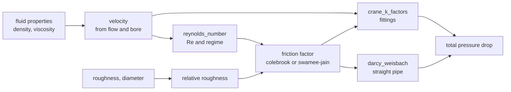

# azoth

**An opinionated port of NeqSim to Rust, with every calculation mirrored in Python.**

Every calculation in this book ships with its equation, where the equation came
from, the range in which it is validated, its assumptions, a worked example, and
the tests that exercise it. Nothing here is prose written alongside code: the
pages under [Hydraulics](./hydraulics/index.md) are **generated from the same
specification files the code is generated from**, so they cannot drift from it.
CI regenerates them and fails on any difference.

**[The specification](./spec.md) says what azoth is** — why Rust rather than Java,
what is in scope and what deliberately is not, and what it costs to add a
calculation. It is normative: where a page here disagrees with it, that page is
wrong.

**[How azoth is put together](./architecture.md)** is the orientation rather than
the rulebook: the small core every domain depends on, the four levels of
composition, where a new piece of your own belongs, and why there is no plugin API.

## The two ideas this library is built around

**Warnings are not errors.** A value outside the range in which a correlation was
validated is still a value. Refusing to return it would be less useful than
returning it with a warning. What the library must never do is return it
*silently*.

**A check that could not run is not a check that passed.** When an optional input
is missing, the range check that depends on it reports `RANGE_CHECK_SKIPPED`
rather than quietly succeeding. "Checked and fine" and "never checked" are
different states, and the API keeps them different.

Both are visible in every result: each carries its warnings, and each can be
asked whether it is clean.

## Reading a calculation page

Each page has the same shape, and the order is deliberate:

| Section | Why it is there |
|---|---|
| Equation | In LaTeX for a reader, and in the form the library evaluates, so you can check one against the other |
| Source | Where the equation came from, and what about that attribution is not confirmed |
| Notes | The reasoning you need in order to judge a number: where this implementation departs from its source, why a constant takes the value it does, which claims are unconfirmed |
| Inputs and outputs | Names, units, and what they mean |
| Valid range | The bounds, what happens when one is violated, and why each exists |
| Assumptions | What is **not** checked at runtime, and is therefore your responsibility |
| Worked example | A fully specified case you can reproduce by hand |
| Tests | What is actually exercised, including what is deliberately skipped and why |

## What is implemented

Four sections, and the difference between them is the point:

- **Hydraulics** — a kernel of correlations over a geometry, through Darcy-Weisbach
  pressure drop.
- **Heat transfer** — steady conduction through a plane wall, and the proof that
  nothing in the pipeline is shaped around pipe flow.
- **Equations of state** — where the model stops being a correlation: an equation of
  state is implicit, mixture-valued, and written in reduced variables rather than in
  quantities with units.
- **Unit operations** — the process layer over the domains, where a calculation becomes
  a transformation of streams. It is not a fourth domain but the composition tier above
  them, and [How azoth is put together](./architecture.md) is the page for how the
  levels nest.

<!-- BEGIN GENERATED: implemented -->
**Equations of state** - [`eos/index.md`](./eos/index.md):

- [`eos.ideal_gas_cp`](./eos/ideal_gas_cp.md)
- [`eos.pr_alpha_ab`](./eos/pr_alpha_ab.md)
- [`eos.pr_departure`](./eos/pr_departure.md)
- [`eos.pr_kappa`](./eos/pr_kappa.md)
- [`eos.pr_mass_density`](./eos/pr_mass_density.md)
- [`eos.pr_molar_volume`](./eos/pr_molar_volume.md)
- [`eos.pr_z_factor`](./eos/pr_z_factor.md)
- [`eos.prsv_kappa`](./eos/prsv_kappa.md)
- [`eos.rachford_rice_binary`](./eos/rachford_rice_binary.md)
- [`eos.vdw1f_mix_binary`](./eos/vdw1f_mix_binary.md)

*Models* — whose specs fix a procedure rather than an equation:

- [`eos.bubble_pressure`](./eos/bubble_pressure.md) — Bubble-point pressure
- [`eos.critical_point`](./eos/critical_point.md) — Mixture critical point
- [`eos.dew_pressure`](./eos/dew_pressure.md) — Dew-point pressure
- [`eos.molar_enthalpy_entropy`](./eos/molar_enthalpy_entropy.md) — Molar enthalpy and entropy of a mixture
- [`eos.ph_flash`](./eos/ph_flash.md) — Pressure-enthalpy flash
- [`eos.ps_flash`](./eos/ps_flash.md) — Pressure-entropy flash
- [`eos.pt_flash`](./eos/pt_flash.md) — Pressure-temperature flash
- [`eos.pure_saturation`](./eos/pure_saturation.md) — Pure-component saturation pressure
- [`eos.stability_test`](./eos/stability_test.md) — Tangent-plane stability test

**Hydraulics** - [`hydraulics/index.md`](./hydraulics/index.md):

- [`hydraulics.choked_flow_area`](./hydraulics/choked_flow_area.md)
- [`hydraulics.control_valve_cv`](./hydraulics/control_valve_cv.md)
- [`hydraulics.crane_k_factors`](./hydraulics/crane_k_factors.md)
- [`hydraulics.darcy_weisbach`](./hydraulics/darcy_weisbach.md)
- [`hydraulics.friction_factor_colebrook`](./hydraulics/friction_factor_colebrook.md)
- [`hydraulics.friction_factor_haaland`](./hydraulics/friction_factor_haaland.md)
- [`hydraulics.friction_factor_swamee_jain`](./hydraulics/friction_factor_swamee_jain.md)
- [`hydraulics.orifice_flow`](./hydraulics/orifice_flow.md)
- [`hydraulics.pump_power`](./hydraulics/pump_power.md)
- [`hydraulics.reynolds_number`](./hydraulics/reynolds_number.md)

**Unit operations** - [`process/index.md`](./process/index.md):

*Models* — whose specs fix a procedure rather than an equation:

- [`process.compressor`](./process/compressor.md) — Compressor
- [`process.expander`](./process/expander.md) — Expander
- [`process.heater`](./process/heater.md) — Heater and cooler
- [`process.mixer`](./process/mixer.md) — Mixer
- [`process.pump`](./process/pump.md) — Pump
- [`process.separator`](./process/separator.md) — Separator
- [`process.splitter`](./process/splitter.md) — Splitter
- [`process.throttling_valve`](./process/throttling_valve.md) — Throttling valve

**Heat transfer** - [`thermal/index.md`](./thermal/index.md):

- [`thermal.conduction_plane_wall`](./thermal/conduction_plane_wall.md)
<!-- END GENERATED: implemented -->

Relief valve *sizing* to a standard is not implemented; `hydraulics.choked_flow_area`
is the isentropic basis, with the standard's de-rating coefficients left to the caller.

## How the pieces fit together

Each calculation is independent, and the composition is done by the caller. That is
still true of every id in the list above, and it is why each one has a worked example a
reader can retrace by hand. A **process layer** - unit operations, and flowsheets that
compose them - is being built on top, and it composes for you; what it gives up in
exchange, and what replaces the guarantee, is set out in
[the roadmap](./roadmap.md) rather than left to be discovered.

The `azoth pipe` command performs the composition shown here, and reports the two
pressure drop contributions separately rather than only their sum - they come from
different methods, and seeing which one dominates is part of judging the answer.

Note the two arrows leaving the friction factor. The straight-pipe loss uses
`f * L/D`, and the fitting loss uses each fitting's equivalent length ratio
scaled by the *same* `f`. Feeding the fitting calculation with anything other
than the friction factor actually used for the pipe would make the two
contributions inconsistent with each other.

## Not for design work yet

The fitting coefficients in `data/fittings/crane_k_factors.csv` are **estimated
dummy values** - plausible magnitudes chosen so the software has something to run
against. They are not from Crane TP-410 or any other standard, and a pressure
drop computed from them can be wrong by a factor of two while looking entirely
reasonable. The `verify_status` column records that, and the
[`crane_k_factors`](./hydraulics/crane_k_factors.md) page says so at the top.

Water and air properties are a different case: real published values, marked
`unverified` because they have not been checked against a primary formulation.

That column exists on the data *this repository ships*, and not on the rows of a
keycard you supply — a deliberate asymmetry rather than a leftover. The shipped data
is the library's own statement about itself, and it is what makes disclosure concrete;
a keycard is yours, and the library does not ask. [Specification,
S6](./spec.md#s6-provenance-is-the-engineers-job-not-the-librarys) has the reasoning.

## How a calculation is added

1. Write a spec under `specs/calcs/<namespace>/<name>.yaml`.
2. Write one function in Python and one in Rust.
3. Declare the tests in the spec.

The documentation, the range checks both implementations enforce, the test cases
both implementations run, and the list of what exists on this page are all derived
from that one file. If you can write the spec, you have written the calc, the tests
and the docs.

Nothing is registered. For a while a calculation had to be added to a dozen places —
an id-to-function table, a result-type table, four PyO3 declaration lists, a type
stub, a batch arm in each language, and this page — and each of those is now either
derived from the calculation's own id or emitted by a generator. What is left is the
boilerplate that attaches a Rust function to a Python name, which is still typed by
hand. [Contributing](https://github.com/PatrickMockridge/Azoth/blob/main/CONTRIBUTING.md)
has the current count, measured rather than remembered.

[How azoth is put together](./architecture.md) carries the same decision table for the
other kinds of addition — a component or a fluid, which is a keycard and no code at all,
and a whole new domain, which is a new crate.

## The batch API

[`azoth.batch`](./batch.md) evaluates any of these calculations over arrays, with
one call crossing into the Rust core instead of N. It is a loop over the same
scalar kernels, not a second implementation, so the cross-language claim is
unchanged - and it deliberately gives up one thing the scalar API provides, which
is unit checking. See the [batch page](./batch.md) before using it.

## Licence

The code is **AGPL-3.0-or-later**. The documentation and the reference data are
**CC-BY-4.0** - attribution only, no copyleft. See `LICENSE` and
`LICENSE-CC-BY-4.0` in the repository root.

The split is deliberate. A validated calculation library is only worth what its
validation is worth, and validation that cannot be read cannot be checked, so the
code carries the copyleft. The equations and coefficients are the part most
people want to reuse or cite, and those should not require adopting a copyleft
obligation to do it.

